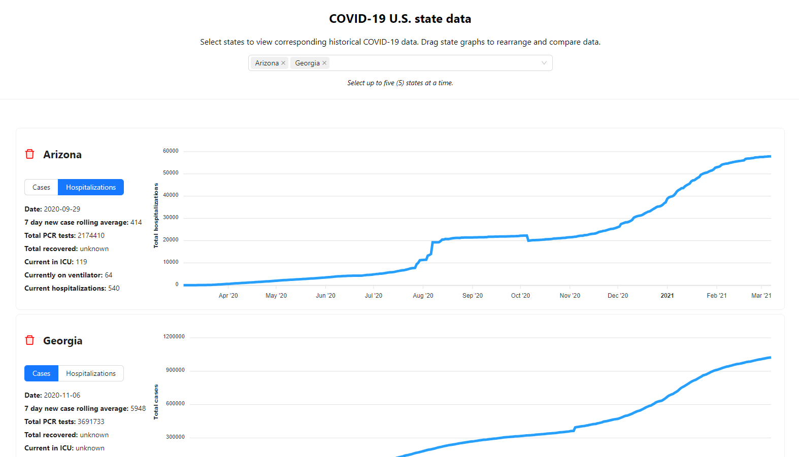

# Waymark Exercise

## Requirements

- Node 16.18 or greater

## Run App

Install dependencies

```
npm install
```

Run app on [localhost](http://localhost:3000)

```
npm start
```

Run tests

```
npm run test
```

## Third party libraries used

- Ant Design (component library)
- React Apex Charts (chart library)
- @hello-pangea/dnd (drag and drop)

## Future Enhancments

Given more time, here is a list of enhancements I could add to improve user experience

- Add the ability to toggle between a bar graph and line graph
- Add option to view all states on one line graph with different colors corresponding to each state
- Add an option to select duration - calendar pop up with start and end date selector

## Notes

- The `App.tsx` file is the container for the app
- The app is wrapped in a context provider (`index.tsx`) to provide common state values and functionality to child components
- Individual components can be found in `src/components`
- Helper functions, constants and types are abstracted into their own files
- Given more time, I would like to write more robust tests. Some of the third party libraries I was using were proving difficult to test user experience properly.

## Example


